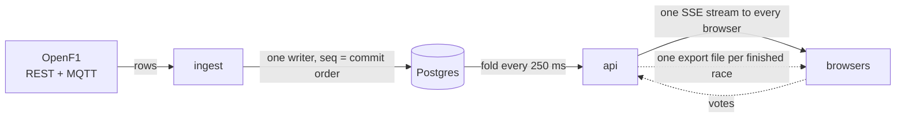

# FormulaTime

Public, non-commercial live F1 timing with race-reactive polls and broadcast
alignment, for a viewer watching a broadcast who wants the timing tower and a
prediction beside it. Part of a project for JDSG 2026, where we create
applications that build up more intuitive habits on system design
architecture thinking.

## How it is shaped



Timing flows one way. Votes are the only writes that come back.

## A race day

Ingest discovers the race session up to a week ahead and selects it 30
minutes before the start. From then on the REST and MQTT lanes write every
timing row into Postgres in received order. The api folds those rows into
one race state and pushes it to every open browser four times a second.
Polls open at the first fold with drivers and lock at half distance. When
the session's window closes, 30 minutes after the scheduled end, the api
exports the race as one file, and the replay page serves it.

## Run it locally

Needs a recording at `apps/ingest/live-logs/11361`; see
`.claude/skills/rehearse-race/SKILL.md`.

```
pnpm install
pnpm db:up
pnpm db:migrate:dev
pnpm sim -- --recording live-logs/11361 --speed 20 --start race
LIVE_SOURCE=./live-logs/sim pnpm dev:ingest
pnpm dev:api
pnpm dev:web
```

Then open <http://localhost:5173>.

## What is where

| Path | Holds |
|---|---|
| `apps/ingest` | The service that talks to OpenF1 and writes sessions and events. |
| `apps/api` | The service that folds events into race state, runs polls, and serves the SSE stream. |
| `apps/web` | The React app: the board, polls, replay and alignment. |
| `packages/domain` | The browser-safe reducer and wire types shared by api and web. |
| `packages/db` | The Prisma schema and migrations. |
| `docs/decisions-adr` | Every accepted ADR, numbered and dated. |
| `docs/retros` | A retro per working day or closed feature. |
| `docs/architecture.md` | How the system is built: the shape, the invariants, per-component detail. |
| `docs/glossary.md` | One definition per term, and the file that owns it. |
| `docs/operations.md` | How the system runs: local ports, deploys, the release. |
| `scripts` | Shell and Node scripts the commit hook, CI and the dev commands call. |
| `.github` | CI and release workflows, the PR template, dependabot config. |
| `.railway` | The Railway infrastructure-as-code definition for api, ingest and Postgres. |
| `.claude` | Agent definitions, skills and settings for working on this repo with Claude Code. |
| `Dockerfile` | The image api and ingest deploy from. |
| `docker-compose.yml` | The local Postgres container. |
| `AGENTS.md` | The rules every agent working in this repo follows. |

## Where the decisions live

`docs/decisions-adr/` holds every architectural decision, numbered and
dated. New decisions are appended.

- [How it is built](docs/architecture.md)
- [Glossary](docs/glossary.md)
- [Operations](docs/operations.md)
- [index](docs/decisions-adr/README.md)

## Working on it

`AGENTS.md` holds the rules every agent and contributor follows. Each app's
own `AGENTS.md` (`apps/<name>/AGENTS.md`) adds that app's local conventions.
