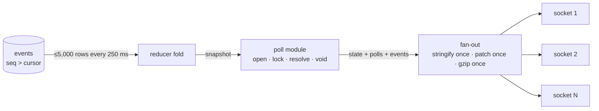

# api

One process. It folds the served session's events into one state and
pushes it to every browser. It owns polls, votes and exports.

## Which session is served

`projector/session-picker.ts`'s `pickSession` chooses, in order: the
`live` session with the latest start; else the `upcoming` session with the
smallest start whose end plus 30 minutes is still ahead; else the most
recent `finished` session. `main.ts` re-runs this check every 5 s. A
same-key row change — `status`, `total_laps`, `meeting_name`,
`circuit_short_name`, `location`, `date_start` or `date_end` — is pushed to
every viewer at once, on that same check, rather than waiting for a
restart to re-pick the row (`projector/serve-session.ts`, ADR-0033).

## One tick

`PG`: the projector reads `events` where `seq > cursor`, at most 5,000
rows a read, every 250 ms; every 40th tick it also re-reads a 2,000-row
window behind the cursor, and a row it had not already applied throws the
fold away and rebuilds it from zero (`projector/projector.ts`). `R`: each
row is applied to one `RaceState` via the reducer. `P`: the poll module
folds from that same state, before the push, so a viewer never sees a
state whose polls have not been judged against it. `F`: the fan-out
serializes and gzips the push once per wire format on a shared deflate
stream — a `state`-format socket gets the full push, a `delta`-format
socket gets a JSON Patch instead, replaced by a full state keyframe every
200 pushes; a socket with more than 1 MiB unsent is dropped
(`fanout/fanout.ts`). When no push has gone out, a heartbeat comment frame
follows the same path every 5 s. `S1`/`S2`/`SN`: every socket of the same
format receives identical bytes.

Every push also carries `events`, the `RaceEvent` rows this tick applied
in seq order (`[]` on a catch-up or rebuild tick), for a client to fold
into its own deep-rewind timeline (ADR-0014). A tick whose frame never
reached a client — a fan-out-level deflate skip, a rejected `pusher.push()`,
or the late-commit detector's own rebuild — forces the next frame this
class actually delivers to be a full `state` push carrying `rebuilt: true`,
on every socket format, regardless of what the caller set, so no
connected client keeps a permanent hole in its timeline (ADR-0032).

## Fan-out

Each `deflate()` call writes to the shared deflate stream and flushes with
`Z_FULL_FLUSH`, so its result is one independently decodable raw-deflate
block with no dependency on any later write to that stream. The heartbeat
frame is a constant, so its gzip block is the same bytes every time;
`Fanout` compresses it once at construction and replays that cached block
on every heartbeat rather than deflating it fresh, which is exactly as
valid since the block is independently decodable. A forced rebuild
(ADR-0032) always delivers a full `state` push rather than a delta:
`diffState` computes a full structural diff between the previous and
current state, so a patch would in fact already span the skipped tick's
changes correctly, but it cannot carry back that tick's own `events` rows
(ADR-0014's deep-rewind log) — which is why the push must instead be
`rebuilt: true`. This reuses the same fallback path a keyframe tick
already takes.

## Polls

Open: the first fold that has both drivers and a lap total opens two
polls, winner and podium. Lock: at `Math.max(1, Math.floor(total_laps /
2))`, never lap 0 even for a very short race
(`packages/domain/src/race-clock.ts`'s `locksAtLap`). Resolve: at the
chequered flag, from `driver_order`. Void: the session finishes with the
poll still open or locked.

A vote is one conditional upsert with the lock check inside it — the
statement inserts only `WHERE EXISTS (... status = 'open')`, so a poll
that locks between a fast in-memory reject and the write still can't take
a vote — and it is acknowledged to the caller only after that insert
commits (`polls/vote-path.ts`).

A viewer is an HttpOnly `viewer_id` cookie, `SameSite=None; Secure` in
production (needed for the cookie to cross the split origins) and
`SameSite=Lax`, not `Secure`, everywhere else (`polls/viewer-identity.ts`).
`POST /api/vote` also checks `Origin` against the `CORS_ORIGIN` allowlist,
and is rate-limited to 60 votes a minute per IP (`polls/viewer-identity.ts`,
`polls/routes.ts`).

## Routes

| Route | Returns | Cache |
|---|---|---|
| `GET /health` | `{ ok, session_key, cursor, caught_up, viewers, build, db }` | none |
| `GET /api/live/events` (`?format=delta`) | SSE stream: `state` and `status` events, or `state`/`delta` with `?format=delta` | `no-cache, no-transform` |
| `GET /api/live/snapshot` | the newest `state` push, verbatim; 503 before the first push | `no-store` |
| `GET /api/polls` | `PollPublic[]` for the currently served session | none |
| `POST /api/vote` | `{ poll_id, option_id, viewer_id, counted: true }`, or `400\|403\|404\|409\|429 { error }` | n/a |
| `GET /api/races` | `RaceIndexEntry[]`, every exported race | none |
| `GET /api/races/:session_key` | the pre-gzipped export file, streamed straight through | `public, max-age=31536000, immutable` |
| `GET /api/races/:session_key/events` (`?since_seq&limit`) | a page of `RaceEvent` rows for any session, live included | `immutable` on a full page, else `no-store` |
| `GET /api/races/:session_key/polls` | `PollPublic[]` for any race, read straight from Postgres | `public, max-age=300` or `no-store` |

Read from `http/routes/live.ts`, `http/routes/races.ts`, `polls/routes.ts`
and `main.ts`.

`/health`'s `ok` is always `true` while the process is serving, regardless
of the database; `db` is informational only — a dead database degrades
reads, it never flips `ok` (`http/health.ts`). `release.yml`'s smoke job
polls `/health` after a release to confirm the running process's `build`
matches the commit just deployed, not the previous one.

## Exports

A `finished` session with at least one event whose endpoint is not
`drivers`, and no `exports` row, is exported once: the file is written
atomically (a temp file, then a rename) to `EXPORT_DIR/<session_key>.json.gz`,
and the row is inserted. A `finished` session with only `drivers` events
(or none) is skipped, logged once per process, and re-checked on later
ticks. An already-exported session is re-exported the same way once
`events` holds a row received after the export's `exported_at` — the etag
the historical-race route sends is `"<session_key>-<exported_at ms>"`, so a
re-export changes it (`export/exporter.ts`).

The exporter runs its own 5 s tick, independent of the projector's tick,
and never overlaps ticks: one that starts while a previous pass is still
running returns immediately (ADR-0001 §2 invariant 2). The database is the
record and disk only a cache: when an exported session's row exists but
its file is missing (Railway's disk is ephemeral), `GET
/api/races/:session_key` regenerates the file from the row's stored
`exported_at`, so the file, the row and the etag can never diverge
(ADR-0009 §3).

One query per tick finds both candidate kinds in a single `UNION ALL`: new
candidates need only check for a missing `exports` row; stale candidates
are found with an `EXISTS` against `events`, narrowed to one session's
rows by `events_session_key_source_time_idx`'s leading column — a few
short per-session scans, since `exports` holds only already-exported
sessions, not a table-wide scan.

`export/prune-exports.ts` is a one-off maintenance command, not part of
the running service: `node apps/api/dist/export/prune-exports.js` inside
the container logs what it would delete; `--apply` deletes the file and
row for a finished session whose only ingest activity was the `drivers`
endpoint.

## Tables

This service reads `sessions` and `events`. It writes `polls`, `votes` and
`exports`. It never writes `events` or `sessions`. See
`../../packages/db/README.md` for the full data model.

`GET /api/races`, the export's `session` object, and the live push's
`state.session` all carry `meeting_name`, `circuit_short_name` and
`location` from the same three nullable `sessions` columns (ADR-0025),
read straight through and never guessed: a session row with none of them
set has `null` on all three surfaces, the same as any other unavailable
field.

## Configuration

| Variable | Default | Meaning |
|---|---|---|
| `DATABASE_URL` | none, required | the pooled Postgres connection (`@formula-time/db`'s `createDb()`) |
| `PORT` | `API_PORT`, else `3000` | the port Fastify listens on; Railway always sets `PORT` |
| `CORS_ORIGIN` | unset (no cross-origin access) | comma-separated allowlist of origins allowed to call this api |
| `NODE_ENV` | unset | `"production"` switches the viewer cookie to `SameSite=None; Secure` |
| `EXPORT_DIR` | `./exports` | where the exporter writes and the races routes serve gzip files from |
| `GIT_SHA` | `RAILWAY_GIT_COMMIT_SHA`, else `"unknown"` | the `build` field on `/health` |

Read from `main.ts` and `http/health.ts`.

## What the log lines mean

| Line | Meaning |
|---|---|
| `api: last 60s` | every 60 s: `viewers`, `delta_viewers`, `pushes`, `state_bytes_gz`, `delta_bytes_gz`, `slow_drops`, `cursor`, `caught_up`, `session_key`, `build` |
| `fold complete` | the projector finished its first full read from cursor 0 |
| `late commit detected` | the detector found a row below the cursor it had not applied; the fold rebuilds from zero |
| `rebuild failed, keeping previous state` | the rebuild's own read failed; the previous fold keeps serving and the next detector pass retries |
| `projector tick failed` | a tick's read rejected; cursor and state are left untouched and the next tick retries |
| `push failed` | a push's promise rejected (a deflate or socket error); the next push actually delivered is forced `rebuilt: true` |
| `poll hook … failed` | one of the poll module's lifecycle hooks threw; the session lifecycle logs it and continues |
| `deflate failed …` | the shared deflate stream rejected a write — on a join's snapshot frame, a heartbeat, or a push; that one frame is skipped |
| `delta diff failed, falling back to a state push for this tick` | building this tick's JSON Patch delta threw; that delta socket gets the full state frame instead, same as a keyframe tick |
| `slow client dropped` | a socket with more than 1 MiB unsent was destroyed and removed |
| `socket write failed` | one socket's write threw; it is dropped, the rest of the fan-out's write loop continues |
| `poll write failed` | a poll module write (open, lock, resolve or void) threw; the write chain still resolves, and each write is conditional on the poll's current status, so it is safely retried on a later tick |
| `polls not opened: total_laps unknown` | the served session has drivers but no `total_laps` yet, so no poll opens; logged once, retried once a `total_laps` refresh lands |
| `export skipped` | a finished session has no non-`drivers` event yet; logged once per process, re-checked every tick |
| `export re-exported` | a finished session's `events` gained rows after its last export; the file and row are rewritten |
| `export failed` | one session's export threw; its row is left as it was and the next tick retries |
| `exporter tick failed` | the exporter's own 5 s tick rejected outright |
| `db probe failed` | the cached `SELECT 1` health probe rejected; `/health`'s `db` field flips to `"unreachable"` |
| `no session found` | `pickSession` found no live, upcoming, or finished session; logged once until one appears |

Exact text is in the source: `main.ts`, `projector/projector.ts`,
`projector/serve-session.ts`, `fanout/fanout.ts`, `polls/poll-module.ts`,
`export/exporter.ts`, `http/health.ts`.

## Reading order

`main.ts` → `projector/serve-session.ts` → `projector/projector.ts` →
`fanout/fanout.ts` → `polls/poll-module.ts` and `polls/vote-path.ts` →
`http/routes/` → `export/exporter.ts`.

See `../../docs/architecture.md` for the whole system, `../../docs/glossary.md`
for the vocabulary, and `../../packages/db/README.md` for the data model.
