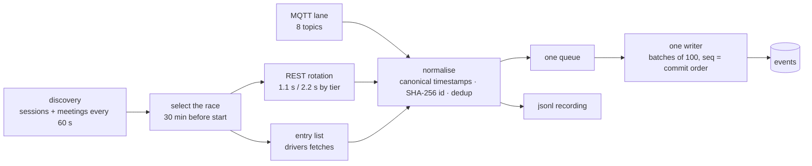

# ingest

The only process that talks to OpenF1. Sole writer of the `sessions` and
`events` tables. Writes every row it queues to a jsonl recording.

## The pipeline



- **discovery** polls OpenF1's `sessions` and `meetings` endpoints every 60 s
  while nothing is live, and upserts every row it sees into `sessions`.
- **select the race** picks the race session whose live window has opened —
  30 minutes before its `date_start` — as the one session the REST rotation
  follows.
- **entry list** fetches the selected session's drivers, on its own schedule,
  independent of the rotation.
- **REST rotation** polls one endpoint per tick from a weighted list, at a
  cadence set by whether OpenF1 credentials are configured.
- **MQTT lane** subscribes to eight timing topics on the live broker and
  feeds the same pipeline as REST.
- **normalise** strips vendor fields, canonicalizes timestamps to epoch-ms,
  hashes each row to a stable id, and drops anything already seen — REST and
  MQTT twins of the same row produce the same id.
- **one queue** holds every normalized row from both lanes in arrival order.
- **one writer** drains the queue in batches of 100, so `seq` order equals
  commit order.
- **jsonl recording** is written at the same moment a row is queued, so the
  recording never drifts from what was written to Postgres.

## Rules

| Rule | Value | File |
|---|---|---|
| Live window | 30 min either side of `date_start`/`date_end` | `openf1/discovery.ts`, `writer/sessions.ts`: `LIVE_WINDOW_MS = 30 * 60 * 1000` |
| Race sessions only | `session_name === "Race"`, exact and case-sensitive | `writer/sessions.ts`: `isRaceSession` |
| Session status | `upcoming` before the window, `live` inside it, `finished` after | `writer/sessions.ts`: `computeSessionStatus` |
| REST tick by tier | 2,200 ms with no OpenF1 credentials, 1,100 ms with both `OPENF1_LOGIN` and `OPENF1_PASSWORD`; `REST_TICK_MS` overrides either | `config.ts`: `loadConfig` (`tierDefaultTickMs`, `restTickMs`) |
| Discovery cadence while idle | 60 s | `openf1/rest-lane.ts`: `this.discoveryIntervalMs = opts.discoveryIntervalMs ?? 60_000` |
| Rotation | 21-slot weighted list: `position` × 7, `intervals` × 7, `laps` × 2, `race_control` × 2, `weather` × 1, `pit` × 1, `stints` × 1 | `openf1/rest-lane.ts`: `POLL_ROTATION` |
| Queue cap | 200,000 rows; beyond it, `push`/`pushAll` drop the newest row and count it | `writer/queue.ts`: `DEFAULT_MAX_QUEUED = 200_000` |
| Writer batch | 100 rows every 250 ms; retry backoff 250 ms doubling to 30 s; on shutdown, give up after 3 consecutive failures of the same batch | `writer/writer.ts`: `DEFAULT_BATCH_SIZE = 100`, `run(intervalMs = 250)`, `BACKOFF_BASE_MS = 250`, `BACKOFF_MAX_MS = 30_000`, `MAX_CONSECUTIVE_FAILURES = 3` |
| Token refresh | 2 min before expiry | `openf1/auth.ts`: `REFRESH_MARGIN_MS = 2 * 60 * 1000` |
| MQTT | ADR-0001 §1: "named timing topics only, never `v1/#`; exactly one connection; re-subscribe on every `connect`". 8 topics; proactive reconnect every 50 min; reconnect backoff capped at 60 s; auth-rejection retry after 30 s; a payload whose own `session_key` disagrees with the selected session is dropped as foreign | `openf1/mqtt-lane.ts`, ADR-0001 §1: `MQTT_ENDPOINTS` (8 entries), `DEFAULT_REFRESH_INTERVAL_MS = 50 * 60_000`, `DEFAULT_MAX_BACKOFF_MS = 60_000`, `DEFAULT_AUTH_RETRY_DELAY_MS = 30_000`, `foreignSinceLog` |

The rotation counted from `POLL_ROTATION` on the branch matches the issue's
"hot endpoints appear most often" description; no row above was copied from
the issue text without checking it against this file.

## MQTT connection lifecycle

Every `connectImpl()` call claims a monotonic generation number before
awaiting anything. If a second, independent `connectNow()`/`reconnectNow()`
starts while the first is still awaiting a token, it claims a higher
generation; the first attempt notices it has been superseded and bails out
instead of racing to set `this.client` — the loser would otherwise open a
live client that silently orphans, or clobbers a client someone else just
opened. Every event listener closes over the generation its client was
created with and ignores events once a newer client has replaced it, so an
old client's own `end()`-triggered `close` can't schedule a second,
redundant reconnect on top of one already in flight.

The very first connect reuses whatever token `auth` already has cached
(likely fetched by the REST lane already); every reconnect — broker-
unreachable, auth-rejected, or the 50-minute proactive timer — forces a
fresh token first.

A rejected `auth.getToken()` is caught inside `connectNow()`, not left to
reject an unawaited promise: `start()`, `reconnectNow()`, and the
`close`/timer paths all call it via `void`, and an uncaught rejection
there would surface as an unhandled promise rejection, capable of
crashing the process under Node's default behavior. It is treated the
same as a broker-unreachable close: logged, retried with backoff.

Every `handleMessage()` call is tracked in `inFlightMessages` while it
runs, so `stop()` can wait for one already in progress — a recording
write already underway must land on disk before `main.ts`'s SIGTERM path
drains the writer and calls `process.exit()`, or a row already queued but
not yet recorded would be silently dropped from the jsonl file. The
message listener queues synchronously before ever awaiting the recorder,
then attaches its own `.then` handler in the same synchronous turn it is
created — so a handler is never "unhandled" from Node's point of view no
matter how long it then sits in `inFlightMessages`, and a rejection (a
handler is expected never to reject) is logged immediately rather than
saved up for `stop()` to discover, since a lane can run for hours between
messages and a call to `stop()`.

## The entry list

| Fetch | When | Retry | Stops when | Fallback |
|---|---|---|---|---|
| Selection fetch | `drivers?session_key=` immediately at session selection | Every 5 min | ≥ 1 row returned | The static list, emitted once |
| Pre-race refresh | 5 min before `date_start`, same `session_key` fetch, once | Next tick, only if the fetch itself threw | Done after one successful attempt (a zero-row response still counts as done) | None |
| Friday fetch | `drivers?meeting_key=`, once the meeting's first session has started, only while that meeting's race session is known and its window hasn't closed | Every 30 min | ≥ 1 row returned | None |
| Budget rule | At most one drivers fetch per tick, taken before the rotation poll | — | — | — |
| Static list | `openf1/entry-list.ts`, season-bound (`ENTRY_LIST_2026`); logs its season once at startup | — | — | — |

Read from `openf1/entry-list-fetches.ts`: `trySelectionFetch`,
`tryPreRaceRefresh`, `checkFridayFetch`, `runFridayFetch`, `runDue`.
`runDue` tries the selection retry, then the pre-race refresh, then the
Friday fetch, and returns as soon as one of them makes a request —
`RestLane.pollOnce` (`openf1/rest-lane.ts`) spends the tick's one request
there before it ever reaches the rotation, so the budget rule above is what
the code does, not a summary of intent.

Each `drivers` row is tagged to the `session_key` in its own payload,
never to the session or meeting the fetch was made for — every OpenF1
`drivers` row carries its own `session_key` and `meeting_key` fields. A
row with no numeric `session_key` of its own can't be tagged or written;
it's counted `malformed`, same meaning as everywhere else. Rows are
grouped by their own key and each group runs through the normal
`enqueueRows` path, so dedup handling stays identical to every other
endpoint. A row naming a session `isKnownSession` doesn't recognize is
dropped and counted `unknownSession`, never written: the FK on
`events.session_key` would otherwise fail the writer's whole batch, which
the writer then requeues forever. A row whose own key differs from the
session the fetch targeted is still written, tagged to the session it
names, and counted `foreign`.

The static list (`openf1/entry-list.ts`, `ENTRY_LIST_2026`) is a
season-bound snapshot, not a feed — a driver swap or livery change after
`ENTRY_LIST_SEASON` won't reach it. `entry-list.test.ts` fails once the
calendar year passes that value, so a stale roster is a red test, not a
silent guess. Emitting it through the normal `drivers` event path, rather
than treating a driver as a table, matches the domain model (HLD §7:
drivers are events; a swap arrives as a new row).

## Session upsert

Discovery upserts every `sessions` row it sees, keyed by `session_key`.
The row's Grand Prix name isn't on the session record itself — it lives on
OpenF1's `meetings` rows — so callers join it in via a `meetingNames` map
built separately: `RestLane` fetches `meetings?year=` once per discovery
tick, and the loader and `fetch-race` fetch `meetings?meeting_key=` once
per session. A `meeting_key` missing from that map, or no fetch made at
all, leaves `meetingName` null rather than guessing.

A rerun must not blank out a naming column (`meetingName`,
`circuitShortName`, `location`) that an earlier run already found.
Prisma's `update` leaves a column untouched only when its key is absent
from the update object entirely — present and `null` sets it to null — so
the upsert omits those three keys, rather than setting them to `null`,
whenever the freshly computed value is `null`. That makes reruns
additive. `create` keeps a literal `null`, since a brand-new row
legitimately has no value yet.

`upsertSession` validates the row (`session_key`, `date_start`,
`date_end`) before writing: a malformed field throws before the database
call, so the caller (`RestLane.discoverOnce()`) can skip that one row and
keep upserting the rest, instead of one bad row stopping the whole
discovery tick.

## Configuration

| Variable | Default | Meaning |
|---|---|---|
| `DATABASE_URL` | none (required) | Postgres connection string; the process exits if unset |
| `OPENF1_LOGIN` | none | OpenF1 sponsor account login; also gates the MQTT default and the REST tier |
| `OPENF1_PASSWORD` | none | OpenF1 sponsor account password |
| `LIVE_SOURCE` | `api` | `api` talks to OpenF1 live; any other value is a directory path replaying a recording through the same queue |
| `LIVE_LOG_DIR` | `./live-logs` | Where the jsonl recording is written |
| `MQTT_ENABLED` | `true` when `OPENF1_LOGIN` is set, else `false` | Turns the MQTT lane on or off; explicit `true`/`false` overrides the default |
| `REST_TICK_MS` | tier default (2200 or 1100) | Overrides the REST rotation's tick interval; an invalid value falls back to the tier default and logs once |
| `LOG_LEVEL` | `info` | Read directly by the logger, not through `config.ts` |

## Commands

| Command | Does | Refuses |
|---|---|---|
| `pnpm ingest:load <recording-dir>...` | Loads a POC-shaped recording (`session.json`, `raw/<endpoint>.jsonl`) into Postgres through the same fetcher → normalizer → queue → writer path; `--replace` deletes and reloads a session already loaded | A session that is still inside its live window (the live service owns it); a non-race session |
| `pnpm ingest:fetch-race <session_key>...` | Pulls a finished historical session straight from OpenF1 and writes it through the same path, also saving it as a recording | Same live-window/non-race guard as `ingest:load`; an unknown `session_key` |
| `pnpm ingest:dump -- <session_key> [--out <dir>] [--force]` | Reads a session's `sessions` row and `events` rows back out of Postgres into the recording layout `ingest:load` reads | An unknown `session_key`; an `--out` directory already holding `polls.jsonl` unless `--force` is passed |
| `pnpm sim` | Drips a recording through the REST lane's file-fetcher path at a chosen speed, no network involved | An `--out-root` directory that already looks like a real recording (holds `polls.jsonl`) |

The drip simulator impersonates the recorder: it writes `session.json` and
appends raw rows into a fresh directory at the pace they originally
arrived (`received_at`), optionally time-compressed, so
`LIVE_SOURCE=<out-root>` makes the REST lane's file fetcher
(`file-fetcher.ts` "root mode") experience the recorded race as live.

```
race day: OpenF1 -> ingest (rest-lane + recorder) -> files -> ingest (LIVE_SOURCE) -> ...
sim:      recording -> simulator -> files -> ingest (LIVE_SOURCE) -> ...
```

## Recording layout

A recording directory holds `session.json` (`{ session, discovered_at }`,
the session in OpenF1's own field names) and `raw/<endpoint>.jsonl` — one
line per event, the recorder's `{ received_at, payload }` shape — plus an
empty `polls.jsonl` whenever the directory should read as a *real*
recording rather than scratch output: the drip simulator's "never wipe a
real recording" guard checks only for that file's presence.

`pnpm ingest:dump` is `load-recording.ts`'s inverse: round trip is the
invariant, so `ingest:load --replace` of a dump's output reproduces the
same `event_id` set in the same `received_at` order as the source,
because it is fed the same payloads, in the same per-endpoint order, that
produced them. The `sessions` table does not keep every field a live
OpenF1 `sessions` row carries — no `session_type`, `year`, `gmt_offset`,
`country_key`, `country_code`, `is_cancelled`, or `meeting_key` column
exists — so a dump's `session.json` omits them too; this is enough for
the loader either way, and only `meeting_name` is permanently
unrecoverable from a dump (it depends on `meeting_key`, resolved once at
load time and not stored back onto the row).

`raw/<endpoint>.jsonl` is written paged by `seq`, appending each page's
rows immediately so a whole race is never held in memory at once; within
one endpoint's file, line order is `seq` order, which is also
`received_at` order, since the single writer that produced these rows
commits in `seq` order (ADR-0007) — the order the round-trip invariant
depends on.

`pnpm ingest:dump` runs against the deployed database over `railway ssh`
(no public proxy), the same as the loader and `fetch-race` — see the
`load-race` skill's "Dump a recording" section for the tarball-out
procedure.

## Historical fetch (fetch-race)

`fetch-race` pulls one finished session straight from OpenF1 into
`sessions` + `events`, as a one-shot CLI command — a historical fetch is
never served on demand and never rerun automatically: the database is the
record once a race is fetched. It reuses `writeSessionThroughLoader`
(`load-recording.ts`) for the write path, so the ADR-0010 live guard, the
`upcoming` -> events -> `finished` ordering, and idempotency
(`skipDuplicates`) are exactly the loader's. What's new, specific to
fetching from the live API rather than reading a recorded capture: a
rate-limited, retrying `Fetcher` (`openf1/rate-limit.ts`); an
emission-order rule keyed on `source_time` instead of `received_at` (a
historical row carries no arrival time); the fetched `drivers` rows ARE
this session's entry list (never the static `ENTRY_LIST_2026`, unlike the
loader and the live REST lane); and the raw response for every endpoint
is also appended to a jsonl recording, so the loader can replay this
session later without OpenF1.

**The lap spoiler rule.** A live capture emits a `laps` row more than
once as a lap fills in — the row a viewer sees mid-lap only has partial
data, with `date_start` set and everything else null, filling in only
once the lap ends. A historical fetch instead gets one already-complete
row per lap. `splitLapRow` turns that one row into the two versions a
live capture would have produced: a start row (durations, sectors, and
speeds nulled) and the complete row (unchanged). Both survive dedup,
since the two payloads differ and so does their `eventId`. The complete
row's *emission order* and its *persisted `source_time`* both use an
adjusted instant — `date_start + lap_duration`, not raw `date_start` —
because the browser fold's scrub (`foldAt`/`truncationBoundary` in
`apps/web`, which stops at the first event whose own `source_time`
exceeds the scrub target) would otherwise reveal the lap's final time for
any scrub target between the lap's start and its true finish: exactly the
spoiler this adjustment exists to prevent.

**Emission order.** `drivers` rows go first, unsorted — a hard
requirement, not a consequence of a (nonexistent) timestamp. Every other
row sorts by `orderKeyMs`: the lap rule above for `laps`; for `stints`
(which carry no timestamp of their own), the `date_start` of the lap
named by `lap_start` and `driver_number`, via the same join
`LiveNormalizer` already builds while normalizing `laps` (which the fetch
order always visits first); every other endpoint's own timestamp
otherwise. Ties break in fetch order, since the rows are built in
`RECORDING_ENDPOINT_ORDER` before a stable sort.

**Recording only on real work.** A rerun (`--replace`, or a retry) is
DB-idempotent via `skipDuplicates`, but a fresh `LiveNormalizer` sees
every row as "new" again — recording those to the jsonl file on every
rerun would duplicate its content unboundedly, unlike the DB write. The
recorder only runs when the run is doing first-time work for the session
(`!alreadyFinished`).

## Recording load

The live REST lane only polls a session inside its ±30 minute window
(`pickLiveSession`, `openf1/rest-lane.ts`), so pointing `LIVE_SOURCE` at
an old recording discovers and upserts the session but never fetches its
rows — historical races need `pnpm ingest:load` instead. It lifts the
in-process path `replay.integration.test.ts` already exercises (file
fetcher -> normalizer -> queue -> writer) into a command, reusing the
same normalizer, queue, writer, and `upsertSession` the live service
uses — no second writer, no second normalizer, one connection (ADR-0007
§1: ingest never updates an `events` row).

**Time-ordered merge.** A bulk read of a complete recording that emitted
one endpoint fully before the next would leave a loaded session's
`events.seq` grouped by endpoint instead of following time — every `laps`
row landing after every `position`/`intervals` row, which the browser
fold (`foldAt`, seq order up to `source_time`) reads as "no lap yet" for
most of the race. `readSessionRowsInTimeOrder` instead reads every
endpoint's rows and emits them in `received_at` order, reproducing the
order a live capture would have produced. Two rows tying exactly on
`received_at` break by endpoint, using `POLL_ROTATION`'s order
(`rest-lane.ts`) — the order one live poll cycle visits them in;
`drivers` never appears in `POLL_ROTATION` (fetched once at session
selection, not polled), so it keeps its own first position. The live REST
lane itself needs none of this — it already emits in time order, one
poll's rows at a time; only a bulk recording load needs the sort.

**The verify line.** Printed once per session after every load, whether
or not `--replace` was used: `endpoint_runs` counts maximal runs of equal
`endpoint` in `seq` order — an endpoint-grouped load has exactly one run
per endpoint, while a correctly interleaved race has many times that
many. `source_time_backsteps` counts rows whose non-null `source_time` is
earlier than the previous non-null one; a few are normal even on a
healthy load (OpenF1 batches arrive slightly out of order), so on its own
it doesn't separate healthy from broken — `endpoint_runs` is the decisive
signal.

**The write path (shared with `fetch-race`).** `writeSessionThroughLoader`
validates the session, applies the ADR-0010 live guard, upserts the row
`upcoming` (unless already `finished`), lets the caller push every event
onto the queue, drains it (or, with `--replace`, deletes then drains as
one transaction), prints the verify line, and only then upserts
`finished`. Upserting `finished` before the events exist would let the
api's exporter (which exports any `finished` row with no `exports` row
yet, on its own 5-second tick, ADR-0009 §2) win the race and write an
export with `"events": []` — exports are immutable, so that file would
need to be deleted by hand. A rerun of an already-`finished` session
skips the `upcoming` step (a rerun must not visibly demote a finished
session), but the final `upsertSession(..., { status: "finished" })`
still runs, so the net effect is unchanged. If the process dies before
every event has committed, the row stays `upcoming`; the exporter never
touches an `upcoming` row, and the next `ingest:load`/`ingest:fetch-race`
of the same session finishes it — the whole path is idempotent by design,
via `skipDuplicates`.

**The ADR-0010 live guard.** The single-writer guarantee (ADR-0007) is
per session, not per process: the live `ingest` service owns any session
inside its live window; the loader and `fetch-race` own only sessions
whose window has closed. Two checks, both against a *live* verdict: the
session's own dates (computed fresh, since it can be loaded before its
window has actually ended — a stale or partial capture), and any existing
`sessions` row (in case the live service is still tracking it under
different dates). A session that is `upcoming` — not live *yet*, but
about to be owned by the live service once its window opens — is also
refused: the Friday/pre-race `drivers` fetches write rows for a session
while it is still `upcoming`, so the live service could otherwise race
this loader for the same `session_key`.

**`--replace`.** Deletes a session's `events` rows and drains the queue's
already-ordered rows back in, as one transaction, so an insert failure
(the writer gives up, per `EventWriter.drainAll()`) rolls the delete back
too and the session's old rows are left exactly as they were.

**The meeting-name fallback.** Two sources, in order: the recording's own
`raw/meetings.jsonl` first (present whenever the session was captured
live or fetched via `fetch-race`, since both route their meetings fetch
through the same jsonl-recorder path every other endpoint uses); when
that file is absent or has no matching row, and a `meetingsFetcher` was
given, one live `meetings?meeting_key=` call through it, rate-limited the
same way `fetch-race`'s own live requests are. With neither source
available, `meeting_name` stays null for this run, same as any other
unavailable field.

## What the log lines mean

| Line | Level | Meaning | Fields |
|---|---|---|---|
| `ingest: fatal error` | error | An unhandled rejection or uncaught exception was caught at the top level before this existed and would otherwise have printed a bare stack trace | `kind`, `reason` |
| `ingest: DATABASE_URL is not set; refusing to start ...` | error | Boot guard (ADR-0004): the process exits immediately | — |
| `ingest: REST_TICK_MS=... is invalid; using the tier default ...` | info | The `REST_TICK_MS` override didn't parse as a positive integer; the tier default is used instead | — |
| `ingest: OPENF1_LOGIN/OPENF1_PASSWORD not set; running unauthenticated ...` | info | No OpenF1 credentials; the process still starts, historical/unauthenticated use only | — |
| `ingest: LIVE_SOURCE=... — replaying a recording instead of OpenF1.` | info | `LIVE_SOURCE` names a directory, not `api`; the file fetcher is used instead of the network | — |
| `ingest: MQTT_ENABLED but no OpenF1 credentials/live source; MQTT lane not started.` | info | `MQTT_ENABLED` is true but there's nothing to authenticate or connect with | — |
| `ingest: started ...` | info | Boot complete: REST lane tick, whether MQTT is running, writer running | — |
| `ingest: last 60s` | info | One line per minute combining both lanes' and the writer's counters | `rest_polls`, `rest_rows`, `rest_errors`, `rest_unjoined`, `mqtt_messages`, `mqtt_rows`, `mqtt_dropped`, `mqtt_unjoined`, `mqtt_foreign`, `writer_inserted`, `writer_skipped`, `writer_failures`, `queue_depth`, `session_key` |
| `ingest: recording root ... is writable (uid=...)` | info | Startup probe: the jsonl recording directory is writable | — |
| `ingest: recording root ... is NOT writable ...` | error | Startup probe: recordings will not be written | — |
| `ingest: recording root ... is on the container's root filesystem, not a mounted volume ...` | error | Startup probe: recordings will not survive a redeploy | — |
| `ingest: SIGTERM received, draining queue` | info | Shutdown started: both lanes are told to stop, then the writer drains | — |
| `ingest: drained (inserted=... skipped=...); exiting` | info | Shutdown finished: the writer's final drain totals, then the process exits | `inserted`, `skipped` |
| `ingest: error while draining: ...` | error | The shutdown drain itself threw | — |
| `recording closed <session_key> rows=<n> path=<dir>` | info | A followed session's live window closed; the recording under `<dir>` is complete | `rows` |
| `rest: following session_key=... (...)` | info | REST lane selected a new session to follow | — |
| `rest: session not selected: upsert failed` | info | The live session's `sessions` upsert failed this tick; selecting it would break every later event insert's FK, so it's left unselected until the next discovery tick retries the upsert | — |
| `rest: poll endpoint=... rows=... new=... malformed=...` | info | One rotation tick's fetch result | `rows`, `new` |
| `rest: poll ... failed: ...` | error | A rotation tick's fetch threw | — |
| `rest: session discovery failed: ...` | error | The `sessions` discovery fetch threw | — |
| `rest: session row skipped: ...` | info | One discovered session row failed validation and was not upserted | — |
| `rest: session ... left its live window; releasing` | info | The followed session's window closed; the REST lane stops following it | — |
| `rest: meetings fetch failed: ...` | error | The `meetings` discovery fetch threw | — |
| `rest: recording failed: ...` | error | The jsonl recorder threw while appending REST rows | `endpoint` |
| `rest: tick failed: ...` | error | The tick loop itself threw | — |
| `entry list: fetched session_key=... rows=... new=... foreign=... unknown_session=...` | info | The selection fetch returned rows | `rows`, `new`, `foreign`, `unknown_session` |
| `entry list: static fallback (...) session_key=...` | info | The selection fetch returned nothing; the static list was emitted once | — |
| `entry list: pre-race refresh session_key=... rows=... new=... foreign=... unknown_session=...` | info | The pre-race refresh returned rows | `rows`, `new`, `foreign`, `unknown_session` |
| `entry list: pre-race refresh session_key=... returned 0 rows` | info | The pre-race refresh returned nothing; still counted as done (a zero-row response is not a failure) | — |
| `entry list: pre-race refresh failed for session_key=...` | error | The pre-race refresh fetch itself threw; retried next tick | — |
| `entry list: friday fetch meeting_key=... rows=... new=... foreign=... unknown_session=...` | info | The Friday meeting-wide fetch returned rows | `rows`, `new`, `foreign`, `unknown_session` |
| `entry list: friday fetch meeting_key=... deferred (...); retrying in 30m` | info | The Friday fetch returned nothing or failed | — |
| `entry list: static fallback is for <year>` | info | Logged once at startup: the season the static list covers | — |
| `mqtt: connected` | info | The MQTT client's `connect` handler fired | — |
| `mqtt: disconnected` | info | The MQTT client's `close` handler fired | — |
| `mqtt: proactive 50-min token refresh, reconnecting` | info | The proactive reconnect timer fired; a fresh token will be fetched on the reconnect | — |
| `mqtt: auth rejected: ...` | error | The broker rejected the connection at CONNACK | — |
| `mqtt: error: ...` | error | The client's `error` handler fired for anything other than an auth rejection | — |
| `mqtt: subscribe error: ...` | error | Subscribing to the topic list failed | — |
| `mqtt: message handler failed: ...` | error | Handling one incoming message threw | `endpoint` |
| `mqtt: token fetch failed, will retry: ...` | error | `auth.getToken()` threw before connecting | — |
| `mqtt: recording failed: ...` | error | The recorder threw while appending MQTT rows | `endpoint` |
| `writer: batch inserted=... skipped=...` | info | A batch committed | `inserted`, `skipped` |
| `writer: batch of ... failed, requeued: ...` | error | A batch's insert threw; requeued at the front for retry | `failures` |
| `writer: ... consecutive failures, queue depth=...` | error | The writer's own retry loop (`run()`) counted another failure in a row; backs off before the next attempt | — |
| `writer: giving up after ... consecutive failures, dropped=...` | error | The shutdown drain (`drainAll()`) gave up on the same batch after `MAX_CONSECUTIVE_FAILURES` (3) retries | `dropped` |
| `writer: queue at capacity, dropped ... rows since the last batch` | error | The queue hit its 200,000-row cap and dropped the newest rows | `dropped` |
| `token: expires_in missing or invalid (...), assuming 3600 s` | error | The OpenF1 token response's `expires_in` wasn't the expected numeric string | — |

## OpenF1 facts

- The free tier locks out during any live session.
- The sponsor bearer token expires in 3600 s: refresh before expiry and on
  every reconnect.
- The live API rejects all date filters; a 404 there means no data yet, not
  an error.
- Live rows mutate in place — identity hashing exists because of this.
- Never run two OpenF1 consumers against the same account at once.

## Reading order

`main.ts` → `config.ts` → `writer/queue.ts` and `writer/writer.ts` →
`openf1/normalize.ts` → `openf1/enqueue.ts` → `openf1/discovery.ts` →
`openf1/rest-lane.ts` → `openf1/entry-list-fetches.ts` →
`openf1/mqtt-lane.ts` → `writer/sessions.ts` → `commands/`.

`openf1/rest-lane.ts` is the tick loop, the session selection and the
weighted rotation. The `sessions?year=`/`meetings?year=` snapshot it reads
is `openf1/discovery.ts` (`SessionDiscovery`), and the three drivers fetches
are `openf1/entry-list-fetches.ts` (`EntryListFetches`); the lane constructs
both and neither imports the lane.

See also [`../../docs/architecture.md`](../../docs/architecture.md) and
[`../../docs/glossary.md`](../../docs/glossary.md).
