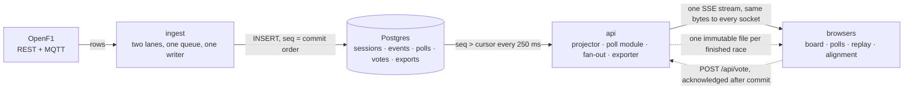
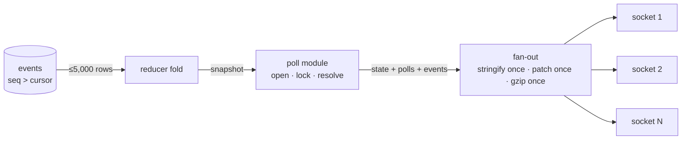

# How FormulaTime is built

Public live F1 timing with race-reactive polls and broadcast alignment. Two Node services and a managed Postgres on Railway, a static React bundle on Netlify, and one shared domain package that folds the same event log on the server and in the browser. Decisions are recorded as ADRs in `docs/decisions-adr/`; this page is the map, not the argument.

## The shape

Timing flows one way: OpenF1 → ingest → one writer → Postgres → the api's projector → one serialised push → every browser. Votes are the only writes that come back, and the only database work a viewer can cause. Finished races leave the loop as one immutable export file each, folded in the browser.

## The five invariants (ADR-0001 §2)

| # | Invariant | Where it lives |
|---|---|---|
| 1 | One shared live stream: cost per tick is one serialisation per wire format and one write per socket. No per-viewer server work. | `apps/api/src/fanout/fanout.ts` |
| 2 | Postgres is touched per event and per join, never per viewer per tick. | `apps/api/src/projector/projector.ts`, `apps/api/src/routes/races.ts` |
| 3 | One writer per table: ingest writes `sessions` and `events`; the api writes `polls`, `votes`, `exports`. Row identity is a content hash, the same on either transport. | `apps/ingest/src/writer/writer.ts`, `apps/ingest/src/openf1/normalize.ts` |
| 4 | Rebuild, never patch: the authority is a fold over the log; a late commit, a skipped frame or a failed push triggers a re-fold and a `rebuilt: true` push. | `apps/api/src/projector/projector.ts` |
| 5 | Acknowledge only after commit: a vote answers 200 only once its row is committed, and the lock is judged inside the same SQL statement. | `apps/api/src/polls/vote-path.ts` |

## Ingest (`apps/ingest`)

One process, the only one that talks to OpenF1. Every 60 s while idle it fetches the season's sessions and meetings and upserts the race sessions. When a race enters its window (30 minutes either side of its scheduled time) it selects it, fetches the entry list, and polls a weighted rotation of timing endpoints every 1.1 s (with credentials) or 2.2 s (without). An MQTT lane subscribes to eight named topics on the same session. Both lanes pass every row through one normaliser (canonical timestamps, envelope stripped, SHA-256 id, per-session dedup) into one in-memory queue; one connection drains it in batches of 100 with `createMany … skipDuplicates`, so `seq` order is commit order. Every queued row is also appended to a jsonl recording on a mounted volume. Three commands share the same write path: `ingest:load` (a recording into Postgres), `ingest:fetch-race` (a finished race from OpenF1), `ingest:dump` (a session back out of Postgres as a recording). Rules: `apps/ingest/AGENTS.md`.

## api (`apps/api`)

One process. Every 5 s it picks the session to serve (live, else the next upcoming, else the last finished) and refreshes that session's row. A projector folds the session's events into one `RaceState` in memory, reading `seq > cursor` every 250 ms in pages of 5,000; every 40 ticks it re-reads a 2,000-row window and rebuilds from zero if any row was missed. The poll module opens two polls (winner, podium) from the first fold that has drivers and a lap total, locks them at half distance, resolves them at the chequered flag, and voids them if the session ends unresolved; a vote is one conditional upsert. The fan-out serialises the push once, gzips it once as an independent block on a shared deflate stream, builds one JSON Patch delta for delta sockets, and writes the same bytes to every socket; a socket with more than 1 MiB unsent is dropped; a keyframe replaces the delta every 200 pushes. The exporter writes one immutable gzip file per finished session and re-exports when the log gains rows. Routes: `/health`; `/api/live/events` (SSE), `/api/live/snapshot`; `/api/polls`, `/api/vote`; `/api/races`, `/api/races/:key` (the export file), `/api/races/:key/events` (paged log), `/api/races/:key/polls`. Rules: `apps/api/AGENTS.md`.

## Domain and data (`packages/domain`, `packages/db`)

`packages/domain` is browser-safe (no `node:*`): the reducer (`race_state.ts`), the JSON Patch diff and apply (`patch.ts`), the race clock and poll lock rule (`race_clock.ts`), run status (`run_status.ts`), and every wire shape (`wire.ts`, `polls.ts`). One reducer, two runtimes, identical output is the property the replay story rests on.

`packages/db` holds the Prisma 7 schema and migrations. Five tables: `sessions` (ingest), `events` (ingest; `event_id` primary key, `seq` bigserial unique, indexes on `(session_key, seq)` and `(session_key, source_time)`, JSON payload), `polls` and `votes` (api; votes keyed by `(poll_id, viewer_id)`), `exports` (api). BigInt keys travel as strings on the wire.

## Web (`apps/web`)

Vite, React 19, React Router. One `EventSource` per tab, opened in delta format, feeds one Zustand store. The store keeps the newest push, a ring buffer of the last 60 pushes (15 s), and, once loaded, a browser-side timeline of the whole race folded from the paged log route. A viewer's delay, on the source-time axis, selects the displayed push from the edge, the buffer, or a timeline fold; everything on the board, including polls, renders from the displayed push, so a delayed viewer is never spoiled. Two seams keep components source-agnostic: the board seam (`board/useBoardState.ts`) serves a live push or a replay's folded push; the time-target seam (`transport/TimeTarget.ts`) lets one transport bar drive the live delay or a replay clock. Replays fold the export file in the browser and play at 1×. Alignment estimates the viewer's broadcast delay by OCR of the lap counter, entirely client-side, with a manual nudge as the floor. Rules: `apps/web/AGENTS.md`.

## One push tick

Everything left of the sockets happens once per tick regardless of audience. The poll fold runs before the push so a viewer never sees a state whose polls have not been judged against it.

## Delivery

Every PR runs typecheck, ESLint at zero warnings, unit, integration on real Postgres, build and the accepted-ADR check; e2e runs when web or domain changed. A review bot posts a verdict; the owner merges. Merging to `main` deploys nothing. A release is a push of `main` to the `release` branch (ADR-0019); Railway builds api and ingest and Netlify builds the bundle from that branch, and a smoke job checks the released SHA on `/health` and the site. Infrastructure is code in `.railway/railway.ts`, planned on every PR and applied on a release push that touches it. Operations: `docs/operations.md`.

## Technology choices

| Layer | Chosen | Instead of | Why | Decided in |
|---|---|---|---|---|
| Runtime | TypeScript on Node 24, ESM, one root `tsc -b` | Go, Elixir | one language for a reducer that runs on the server and in the browser | ADR-0002 |
| Transport | Server-Sent Events with gzip and deltas | WebSockets, polling | one-directional reads, native reconnect, same bytes to every socket | ADR-0001, ADR-0013 |
| Authority wake-up | poll `events` every 250 ms on `seq` | LISTEN/NOTIFY | works behind any pooler; one cheap indexed query | ADR-0001 §3 |
| Ingest ordering | one queue, one connection | two writers with a detector as the mechanism | a cursor cannot skip a row when one connection inserts | ADR-0007, ADR-0010 |
| Feed | REST plus MQTT, content-hash identity | one lane | MQTT is faster and cheaper; REST is the safety net; identical ids make them collapse | ADR-0012, ADR-0030 |
| Database | managed Postgres, Prisma 7 with the pg adapter, migrate on deploy | hand-written SQL, Drizzle | few queries; schema as the design document | ADR-0004, ADR-0005, ADR-0023 |
| Finished races | one immutable gzip export, folded in the browser | server-side replay | one file read per viewer per race, never per tick | ADR-0009, ADR-0018 |
| Deep rewind | events on every push, browser backfills pages | per-tab server replay | zero per-viewer server state | ADR-0014 |
| Web | Vite, React 19, Zustand for the stream, TanStack Query for requests, CSS Modules | Next.js, Redux | a stream is not request data; no server rendering needed | ADR-0002 |
| Alignment | client-side OCR, vendored engine, manual nudge floor | server-side vision | the broadcast is on the viewer's screen | ADR-0001 call 7 |
| Hosting | Railway (api, ingest, Postgres), Netlify (bundle), split origins, release branch | one VM, deploy on merge | managed TLS, secrets, restarts, migrations; a deliberate release with proof | ADR-0008, ADR-0019 to 0021 |
| Tests | vitest unit with fakes, vitest integration on real Postgres, Playwright against the rehearsal stack | mocking the database | constraints cannot be proven against a fake | ADR-0002, ADR-0006, ADR-0017 |

## Trade-offs, in one line each

- One api process, no pub/sub: zero coordination now; a restart drops every viewer for seconds; revisit when a load test says one process cannot hold the audience.
- Polling Postgres instead of LISTEN/NOTIFY: pooler-proof and testable; four idle queries a second.
- SSE, not WebSockets: native reconnect and proxy-friendly; no client-to-server channel, so votes are POSTs.
- Content-hash identity, revisions as new events: idempotent lanes and reloads; several rows per lap on live.
- Browser folds replays: no per-viewer server state; the whole log in browser memory.
- Split origins: static hosting with no compute; cross-origin cookies and an Origin check on the vote route.
- Release branch, deploy on demand: frequent merges cost nothing; someone must push.
